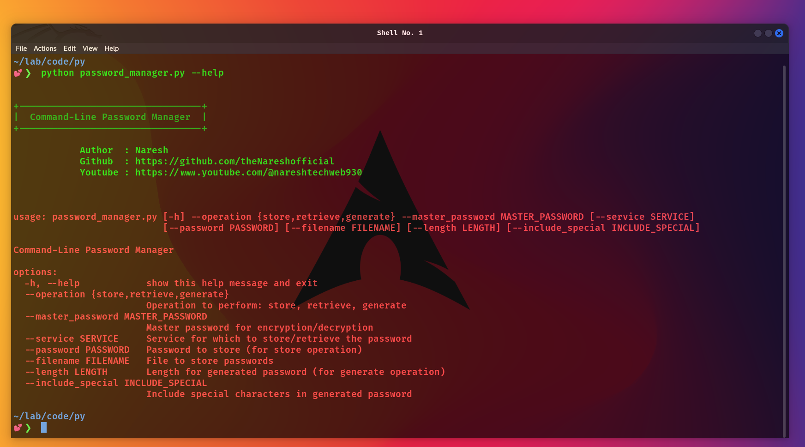

<p align="center">
            
</p>

# Command-Line Password Manager

The Command-Line Password Manager is a Python-based application that allows users to securely **store**, **retrieve**, and **generate passwords** for various services. The application uses cryptographic methods to ensure that stored passwords are encrypted and accessible only with the correct master password.

## Features

- Store passwords securely with a master password.
- Retrieve passwords with the master password.
- Generate strong, random passwords with customizable length and special characters.
- Encrypts passwords using the PBKDF2 key derivation function and Fernet symmetric encryption.

## Installation

```
# Clone repo
$ git clone https://github.com/theNareshofficial/Password-Manager.git

# Change directory
$ cd Password-Manager

# Install requirements
$ pip install -r requirements.txt

# Store password
$ python password_manager.py --operation store --master_password "mysecratepassword" --service "gmail" --password "mygmailpassword"

# Retrieve password
$ python password_manager.py --operation retrieve --master_password "mysecratepassword" --service "gmail" --password "mygmailpassword"

# Generate password
$ python password_manager.py --operation generate --master_password "mysecratepassword"
```


# Help command

```
# Help command
$ python password_manager.py

usage: password_manager.py [-h] --operation {store,retrieve,generate} --master_password MASTER_PASSWORD [--service SERVICE]
                           [--password PASSWORD] [--filename FILENAME] [--length LENGTH] [--include_special INCLUDE_SPECIAL]

Command-Line Password Manager

options:
  -h, --help            show this help message and exit
  --operation {store,retrieve,generate}
                        Operation to perform: store, retrieve, generate
  --master_password MASTER_PASSWORD
                        Master password for encryption/decryption
  --service SERVICE     Service for which to store/retrieve the password
  --password PASSWORD   Password to store (for store operation)
  --filename FILENAME   File to store passwords
  --length LENGTH       Length for generated password (for generate operation)
  --include_special INCLUDE_SPECIAL
                        Include special characters in generated password
```

# Docker Installtion

```
# Docker image build command
$ docker build -t password_manager.py

# Docker Store password
$ Docker run -t  password_manager.py --operation store --master_password "mysecratepassword" --service "gmail" --password "mygmailpassword"

# Docker Retrieve password
$ Docker run -t password_manager.py --operation retrieve --master_password "mysecratepassword" --service "gmail" --password "mygmailpassword"

# Docker Generate password
$ Docker run -t password_manager.py --operation generate --master_password "mysecratepassword"


```

# Security Notice

- Keep your master password secure. If someone gains access to your master password, they can decrypt all stored passwords.
- Store the password file (passwords.json) in a secure location.
- If you lose your master password, you will not be able to decrypt your stored passwords.

# Tested OS

- Windows
- Linux
- MAC

# Key concept

- **Encryption:** The process of converting plaintext into ciphertext to protect sensitive information. In this program, encryption is used to secure passwords.

- **Decryption:** The reverse of encryption, where ciphertext is converted back into plaintext. This allows you to retrieve and view stored passwords securely.

- **Master Password:** A password used to derive the encryption key. It is required to store and retrieve encrypted data. The security of the entire system relies on the secrecy and strength of this master password.

- **Key Derivation Function (KDF):** A cryptographic function that derives a unique key from a given password and salt. In your program, PBKDF2HMAC with SHA256 is used to derive the encryption key from the master password.

- **Salt:** A random value used in conjunction with the key derivation function to ensure that derived keys are unique, even if two users have the same master password. It helps defend against brute-force attacks and rainbow table attacks.

- **Fernet:** A symmetric encryption scheme from the cryptography library. It is designed for simplicity and security, providing encryption and decryption functions.

- **Password Generation:** The process of creating strong and random passwords. It often involves random character selection and can include special characters to increase password complexity.

<h1 align="center">ThankYou🎉</h1>